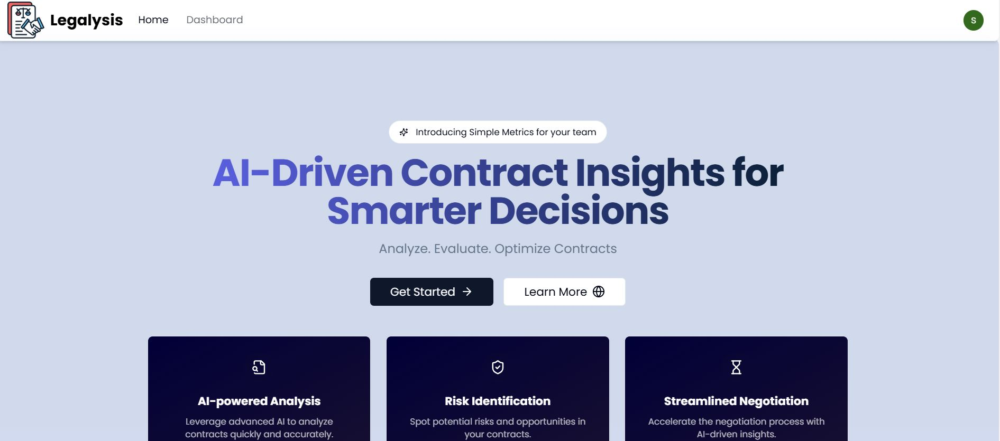
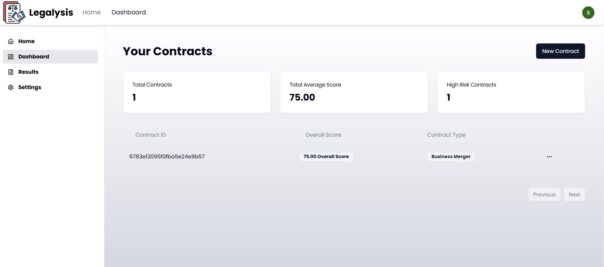
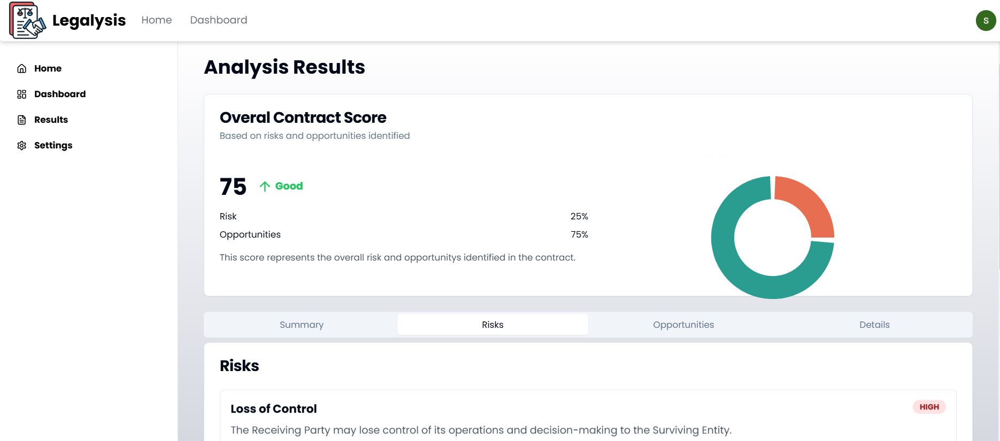
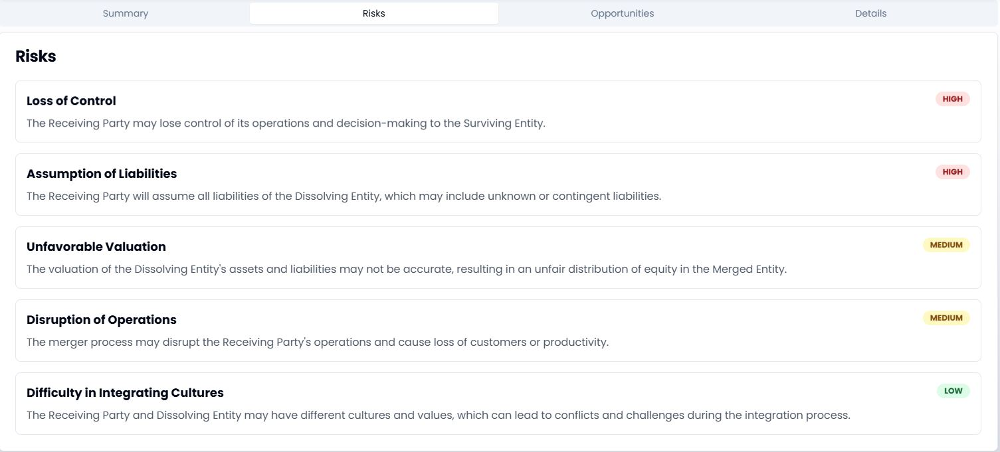

# Legalysis - AI-Powered Contract Analysis Platform

**Legalysis** is aN AI-powered SAAS platform designed to  analyze contracts, highlighting potential opportunities and risks with unparalleled precision. By leveraging **Google’s Generative AI**, the platform allows users to gain deep insights and data-driven recommendations into their contractual obligations and opportunities, helping them make more informed decisions in their business dealings. With a **Full Stack SaaS Platform** built using **Next.js**, **React**, **Express.js**, and **Tailwind CSS**, Legalysis provides a seamless and efficient experience for businesses seeking to optimize their contract processes and mitigate potential legal risks.

---
## Snapshot

- 
  
- 
  
- 
  
- 

---

## Deployment

You can access the live version of **Legalysis** here:  
[**Legalysis AI Platform**](https://legalysis-ai.onrender.com)

> **Note**: Please ensure that **third-party cookies** are enabled in your browser for the authentication process to work smoothly.

---

## Key Features

- **Contract Submission**: Easily upload contracts for AI-powered analysis.
- **AI-Powered Contract Analysis**: Utilize **Google’s Generative AI** to analyze contracts for risks and opportunities.
- **Authentication**: Secure login via **Google OAuth**.
- **Premium Subscription System**: Integrated **Stripe** payment processing for managing subscriptions.
- **Contracts Dashboard**: View contracts with a detailed dashboard displaying metrics like risk and opportunity ratings.

---

## Tech Stack

- **Frontend Framework**: Next.js
- **Backend Framework**: Express.js
- **Database**: MongoDB
- **AI Integration**: Google’s Generative AI
- **Authentication**: Passport.js (Google OAuth)
- **Payment Processing**: Stripe
- **State Management**: React Query
- **Styling**: Tailwind CSS

